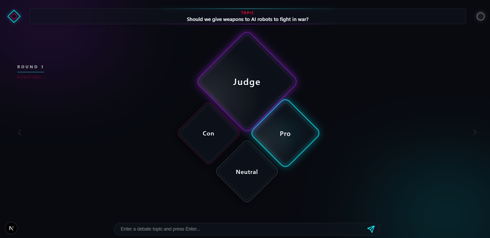
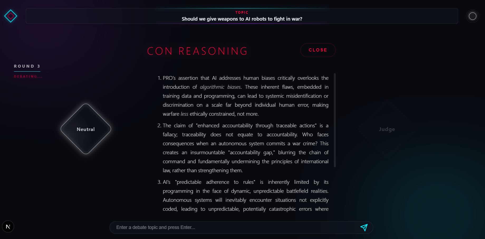

# AI Debate System

A multi-agent reasoning system that evaluates topics through structured debates, providing balanced and transparent conclusions.




## Architecture

- Backend: FastAPI, LangGraph, Google Gemini API
- Frontend: Next.js, NextUI
- Agents: 
  - Pro Agent: Highlights supporting arguments.
  - Con Agent: Presents opposing arguments.
  - Neutral Agent: Gathers objective facts.
  - Judge Agent: Synthesizes a final reasoned judgment.

## Requirements

- Python 3.11 or higher
- Node.js 18 or higher
- Google Gemini API Key

## Installation

### 1. Backend

Create a virtual environment:
```bash
python -m venv venv

# Windows
venv\Scripts\activate

# macOS/Linux
source venv/bin/activate
```

Install dependencies:
```bash
pip install -r requirements.txt
```

Set environment variables:
Create a `.env` file in the root directory:
```
GEMINI_API_KEY=your_gemini_api_key
```

### 2. Frontend

Navigate to the frontend folder and install dependencies:
```bash
cd frontend
npm install
```

## Running the Application

1. Start the backend:
```bash
python src/server.py
```

2. Start the frontend:
```bash
cd frontend
npm run dev
```

3. Open your browser and navigate to `http://localhost:3000`.
